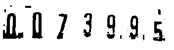

# ocr_watermeterreading

1) Original Image

2) Rotated Image 

3) Cropped Image 

4) Extracting  black pixel region from the image.

5) Removing Noise(unwanted black blocks) in the image. 

6) Removing noise (small blocks) using filters. 

7) Extracting red pixel region from the image.

8) Combining images from 6 and 7 stages

9) Applying ocr on this combined image. 

10) Setup Installation

            ****  Software required :         1)opencv
                                        2)visual studio

            ****  Install visual studio and link opencv to visual studio.

            ****   Add deskew.h file to the project folder.

            ****  Create new .cpp file in the project
         
            **** copy trainingknnc++.txt  to the .cpp file created above.(Make sure that directory inside the imread points to the images in ocrknn folder)

            ****  copy watermeter_gaia.txt  to c++ file and change the directory to image of watermeter reading. 

=============================================================================================================================

•	It is one of the solution of Internet of Things where there is a requirement to implement OCR through  Computer Vision to digitalize the data on Watermeter. 
•	Implemented Region Growing Algorithm for the removal of Noise blobs and performed Noise reduction techniques like Dilation and Erosion. 
•	Applied K-Nearest Neighbours(supervised) Algorithm for the classification of digits.

==================================================================================================================

